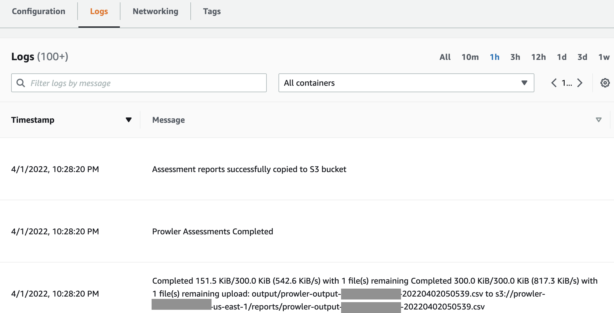

# `Perform security assessment in AWS Organizations using Prowler on AWS Fargate and Terraform`

## Description

This [Terraform](https://www.terraform.io/) module helps you assess your multi-account environment in [AWS Organizations](https://aws.amazon.com/organizations/) using [Prowler](https://github.com/toniblyx/prowler) security assessment tool  deployed on [AWS Fargate](https://aws.amazon.com/fargate/). It assesses all accounts using a time-based schedule expression in [Amazon CloudWatch](https://aws.amazon.com/cloudwatch/), creates assessment reports in CSV format, and stores them in an [Amazon Simple Storage Service (S3)](https://aws.amazon.com/s3/) bucket.

With AWS Fargate, there are no upfront costs and you pay only for the resources you use. You pay for the amount of vCPU, memory, and storage resources consumed by your containerized Prowler application running on AWS Fargate.

## Features

- Programmatically assess the security posture of your accounts in AWS Organizations using Terraform Infrastructure as Code.
- Send Prowler findings to S3 Bucket.

## Solution overview

The solution works as follows:

- A time-based CloudWatch Event starts a Fargate task hosting Prowler on a schedule you define.
- Fargate pulls a Prowler Docker image from Amazon Elastic Container Registry (ECR).
- Prowler scans your AWS infrastructure and assumes IAM roles across the accounts.
- Prowler writes the scan results to CSV files in an S3 bucket.

## Prerequisites

The following prerequisites are required to deploy the solution:

1. [Download](https://www.terraform.io/downloads.html) and set up Terraform. Refer to the official Terraform [instructions](https://learn.hashicorp.com/collections/terraform/aws-get-started) to get started.

2. Make sure that your Terraform environment is able to assume an administrative role to implement the resources described in this blog across your member and prowler deployment accounts.

3. Install latest version of the [AWS CLI](https://docs.aws.amazon.com/cli/latest/userguide/install-cliv2.html) or use the [AWS CloudShell](https://docs.aws.amazon.com/cloudshell/latest/userguide/welcome.html). To use the AWS CLI, you must make sure that you have profiles to assume roles across your accounts. You can get more information about creating CLI configuration files in the [AWS CLI user guide](https://docs.aws.amazon.com/cli/latest/userguide/cli-configure-files.html).

4. A VPC with 1 subnet that has access to the Internet plus a security group that allows outbound access on Port 443 (HTTPS). You will need the Subnet and VPC IDs in your input variables.


## Module Components

1.  [main.tf](./main.tf)
    * Creates an Amazon ECR Cluster to run the Prowler container.
    * Creates a Prowler task definition for AWS Fargate.
    * Enables Amazon CloudWatch Log Group to visualize Prowler execution logs.
    * Implements AWS IAM role to trigger container tasks via Amazon EventBridge rule.
    * Allows an Amazon EventBridge rule to schedule and invoke the Prowler container using a [rate or cron expression](https://docs.aws.amazon.com/AmazonCloudWatch/latest/events/ScheduledEvents.html).

2.  [outputs.tf](./outputs.tf)
    * Defines the [Terraform output](https://www.terraform.io/docs/language/values/outputs.html) values of this Terraform module.

3.  [provider.tf](./provider.tf)
    * Defines the [Terraform provider](https://www.terraform.io/docs/language/providers/index.html) to interact with AWS cloud and/or Terraform state files.

4.  [variables.tf](./variables.tf)
    * Defines the input variables for this Terraform module.

5.  [run-prowler-reports.sh](./run-prowler-reports.sh)
    * Refer to the script for line-by-line documentation of each command.
    * Loops through all AWS Accounts in AWS Organization, and by default, runs Prowler as follows:
        * -R: used to specify Cross-Account role for Prowler to assume to run its assessment.
        * -A: used to specify AWS Account number for Prowler to run assessment against.
        * -g cislevel2: used to specify cislevel2 checks for Prowler to assess
        * -M csv: used to output Prowler reports to CSV files.

6. [Dockerfile](./Dockerfile)
    * Text document that contains all the commands to build Prowler image. 

## Installation steps

1. Download the Terraform code to an environment configured to access the AWS Organizations Management and member accounts.

    ``` 
        git clone https://gitlab.aws.dev/ioawssec/aws-tf-prowler-fargate
    ```

2. Implement the AWS IAM role module.
    - Deploy the [aws-tf-iam-role](./modules/aws-tf-iam-role/main.tf) module to your AWS Organizations Management account.
    <!-- - Deploy the [aws-tf-iam-role](./modules/aws-tf-iam-role/main.tf) module to an account designated as your Prowler deployment account (typically a security account). This is the account that will run Prowler. -->
    - Deploy the [aws-tf-iam-role](./modules/aws-tf-iam-role/main.tf) module to your AWS Organizations member accounts to be assessed by Prowler.

3. Perform the following steps in your Prowler deployment account (for example, Security account):

    - Create an Amazon ECR repository using the [AWS CloudShell](https://aws.amazon.com/cloudshell/).

     ```
        aws ecr create-repository \
        --repository-name prowler-repo \
        --image-scanning-configuration scanOnPush=true \
        --encryption-configuration encryptionType=KMS
    ```

    Make a note of the ECR repository URI. Format: _01234567890.dkr.ecr.us-east-1.amazonaws.com/prowler-repo_.


4. Build and push the Docker image to ECR.

    ```
        aws ecr get-login-password --region us-east-1 | docker login --username AWS --password-stdin 01234567890.dkr.ecr.us-east-1.amazonaws.com
        
        docker build --platform=linux/amd64  --no-cache -t prowler:latest -f Dockerfile .
        
        docker tag prowler:latest 01234567890.dkr.ecr.us-east-1.amazonaws.com/prowler:latest
        
        docker push 01234567890.dkr.ecr.us-east-1.amazonaws.com/prowler:latest
    ```

5. Deploy Terraform code

    - Modify the [main.tf](./main.tf) file in the root module using a text editor and update the source variable parameters, deployment account id, ECR image URI (from step 3), VPC security group id and subnet id, and the CloudWatch Event [Schedule Expression Rule](https://docs.aws.amazon.com/AmazonCloudWatch/latest/events/ScheduledEvents.html). The `source` argument in a [module block](https://www.terraform.io/docs/language/modules/syntax.html) tells Terraform where to find the source code for the desired child module. Typical sources include Terraform Registry, local paths, S3 buckets, and many more. See the documentation on [Terraform Module Sources](https://www.terraform.io/docs/language/modules/sources.html) for additional information.
    
    - Now that you have updated the script with your variable configuration, you can initialize the directory. Initializing a configuration directory downloads and installs the AWS provider, which is defined in the configuration:

    ``` 
        terraform init
    ```
    You should see a message that says `Terraform has been successfully initialized!` and the version of the provider that was installed.

    - You should format and validate your configuration. The `terraform fmt` command automatically updates configurations in the current directory for readability and consistency. You can also make sure that your configuration is syntactically valid and consistent using the `terraform validate` command:

    ``` 
        terraform fmt
        terraform validate
    ```

    - Apply the configuration to create the infrastructure:

    ``` 
        terraform apply
    ```

    Before applying any configuration changes, Terraform prints out the execution plan to describe the actions that Terraform will take to update your infrastructure. Once prompted, you will need to type `yes` to confirm that the plan can be run.
    

6. Manually run the container task

    By default, the Prowler task is configured to run every 7 days using the CloudWatch Event Rule. You can trigger a manual run of the task using the following command. Ensure you replace the value of the `subnet-0111111111111111111` with your subnet id. In addition, the task requires Internet connection to download Prowler source code.

    ```
        aws ecs run-task --launch-type FARGATE \
        --task-definition prowler-security-assessment \
        --cluster prowler-security-assessment-cluster \
        --network-configuration "awsvpcConfiguration={subnets=[subnet-0111111111111111111],assignPublicIp=ENABLED}"
    ```

You have successfully implemented the Prowler security assessment tool on AWS Fargate using Terrraform. You should see see logs from the container tasks in your ECS task definition.
## 

## Usage

To implement Prowler in a designated Prowler deployment account, update the [main.tf](main.tf). file in the solution's root directory with your input variables.

_Example usage below._

```hcl

module "prowler_deployment_account" {
  source = "./modules/aws-tf-prowler-fargate"
  providers = {
    aws = aws.prowler_deployment_account
  }
  
  deployment_accountid = "1234567890"
  ecr_image_uri = ""1234567890.dkr.ecr.us-east-1.amazonaws.com/prowler""
  prowler_container_sg_id = "sg-00ab1234567c12345"
  prowler_container_vpc_subnet_id = "subnet-0b0f1234eb1234567"
  prowler_schedule_task_expression = "rate(7 days)"

  tags = {
    Application = "prowler-security-assessment"
    Deployment  = "Terraform"
  }
}

```

Prowler supports native integration to send findings to AWS Security Hub. This integration allows Prowler to import its findings to AWS Security Hub for a comprehensive view which aggregates, organizes, and prioritizes your security alerts or findings. Refer to the [Security Hub Integration](https://github.com/prowler-cloud/prowler#security-hub-integration) for further information.


## Provider Requirements

All provider requirements can be found in [providers.tf](./providers.tf).


## Resources

| Name                                                  | Type         |
| ---------                                             |----          |
| aws_iam_role                                          | Resource     |
| aws_iam_role_policy                                   | Resource     |
| aws_iam_role_policy_attachment                        | Resource     |
| aws_s3_bucket                                         | Resource     |
| aws_s3_bucket_versioning                              | Resource     |
| aws_s3_bucket_acl                                     | Resource     |
| aws_s3_bucket_server_side_encryption_configuration    | Resource     |
| aws_s3_bucket_public_access_block                     | Resource     |
| aws_s3_bucket_policy                                  | Resource     |
| aws_ecs_cluster                                       | Resource     |
| aws_ecs_task_definition                               | Resource     |
| aws_cloudwatch_log_group                              | Resource     |
| aws_cloudwatch_event_rule                             | Resource     |
| aws_cloudwatch_event_target                           | Resource     |


## Input Variables

All variable details can be found in [tf-prowler-aws-fargate/variables.tf](variables.tf). Refer to the file for default variable values.

| Variable Name               | Description                                                             | Required  |
| -------------               | -----------                                                             | --------  |
| `bucket`                    | The name of the bucket.                                                 | Yes       |
| `inbound_tags`              | Tag map to be applied to all taggable resources created by this module. | Yes       |
| `kms_master_key_id`         | The AWS KMS master key ID used for SSE-KMS encryption.                  | Yes       |
| `ecs_cluster_name`          | AWS Fargate Cluser Name.                                                | Yes       |
| `ecs_task_definition_name`  | Unique ECS Task Definition Name.                                        | Yes       |
| `ecs_task_execution_arn`    | Name of the IAM role that allows Fargate to publish logs to CloudWatch and to download Prowler image from Amazon ECR | No |
| `ecs_task_role_name`        | Name of the IAM role with the permissions that Prowler needs to complete its scans.  | Yes |
| `ecs_task_role_arn`         | Arn of the IAM role with the permissions that Prowler needs to complete its scans.   | Yes |
| `fargate_task_cpu`          | CPU Reservation for AWS Fargate Task.                                    | Yes       |
| `fargate_memory`            | Memory Reservation for AWS Fargate Task.                                 | Yes       |
| `ecr_image_uri`             | URI Path of the Prowler Docker Image - Preferably from ECR.              | Yes       |
| `container_name`            | Name of the Container within AWS Fargate.                                | Yes       |
| `cwe_log_prefix`            | Prefix for CloudWatch Event Log Group.                                   | Yes       |
| `reporting_bucket`          | Name of the S3 bucket to store Prowler reports.                          | Yes       |
| `reporting_bucket_account_id` | Account ID of the S3 bucket to store prowler reports.                  | Yes       |
| `prowler_schedule_task_expression` | Schedule Expression to run the Prowler AWS Fargate Task.          | Yes       |
| `prowler_scheduled_task_event_role`| Name of the IAM Role for the CloudWatch Event Task Scheduler for AWS Fargate. | Yes       |
| `fargate_platform_version`  | FARGATE Platform Version.                                                | Yes       |
| `prowler_container_sg_id`   | Prowler container Security Group ID.                                     | Yes       |
| `prowler_container_vpc_subnet_id`  | Prowler container Subnet ID.                                      | Yes       |
| `log_retention_in_days`     | Number of days container task logs will be retained in CloudWatch.       | Yes       |
| `assign_container_public_ip`| Assign public IP to the container.                                       | Yes       |
| `tags`                      | A map of tags (key-value pairs) passed to resources.                     | Yes       |


## Outputs

All output details can be found in [outputs.tf](./outputs.tf).

| Output Name               | Description                                |
| -------------             | -----------                                |
| `ecs_cluster_arn`         | ARN of the AWS Fargate Cluster             |
| `ecs_task_definition`     | ARN of the ECS Task Definition             |
| `s3_bucket`               | ARN of the S3 Bucket                       |
| `iam_role`                | ARN of the Prowler role                    |
| `cloudwatch_log_group`    | ARN of the Amazon CloudWatch Log Group     |


## Changelog

A complete Changelog history can be found in [CHANGELOG.md](./CHANGELOG.md).

# Security

See [CONTRIBUTING](CONTRIBUTING.md#security-issue-notifications) for more information.

## License

This library is licensed under the MIT-0 License. See the LICENSE file.
